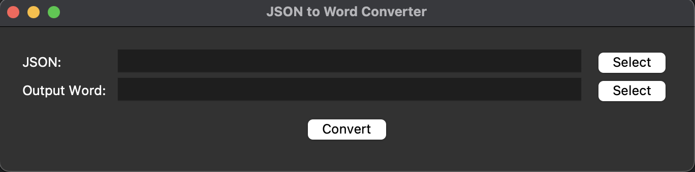
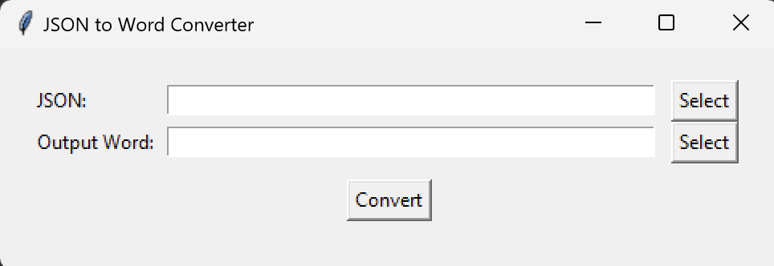

# JSON to Word Converter

JSON to Word Converter is a Python application that converts JSON data into a Word table. The application provides a simple graphical user interface (GUI) using Tkinter, allowing users to select a JSON file and save the converted data as a Word document.

## MacOS
 
## Windows


## Features

- Load JSON files and display the data in a Word table.
- Simple and user-friendly Tkinter-based GUI.
- Save the converted data as a Word document.

## Requirements

- Python 3.x
- Tkinter (usually included with Python)
- `python-docx` library

## Installation

1. Clone the repository

2. Install the required Python packages:
    ```sh
    pip install python-docx
    ```

## Usage

1. Run the application:
    ```sh
    python main.py
    ```

2. In the GUI:
    - Click the "Select" button next to the "JSON File" field to choose a JSON file.
    - Click the "Select" button next to the "Output Word File" field to specify the output Word document path.
    - Click the "Convert" button to convert the JSON data to a Word table.

## Example

Given a JSON file `example.json`:

```json
{
    "name": "test",
    "short_name": "test",
    "start_url": ".",
    "display": "standalone",
    "background_color": "#0175C2",
    "theme_color": "#0175C2",
    "description": "A new Flutter project.",
    "orientation": "portrait-primary",
    "prefer_related_applications": false,
    "icons": [
        {
            "src": "icons/Icon-192.png",
            "sizes": "192x192",
            "type": "image/png"
        },
        {
            "src": "icons/Icon-512.png",
            "sizes": "512x512",
            "type": "image/png"
        },
        {
            "src": "icons/Icon-maskable-192.png",
            "sizes": "192x192",
            "type": "image/png",
            "purpose": "maskable"
        },
        {
            "src": "icons/Icon-maskable-512.png",
            "sizes": "512x512",
            "type": "image/png",
            "purpose": "maskable"
        }
    ]
}
